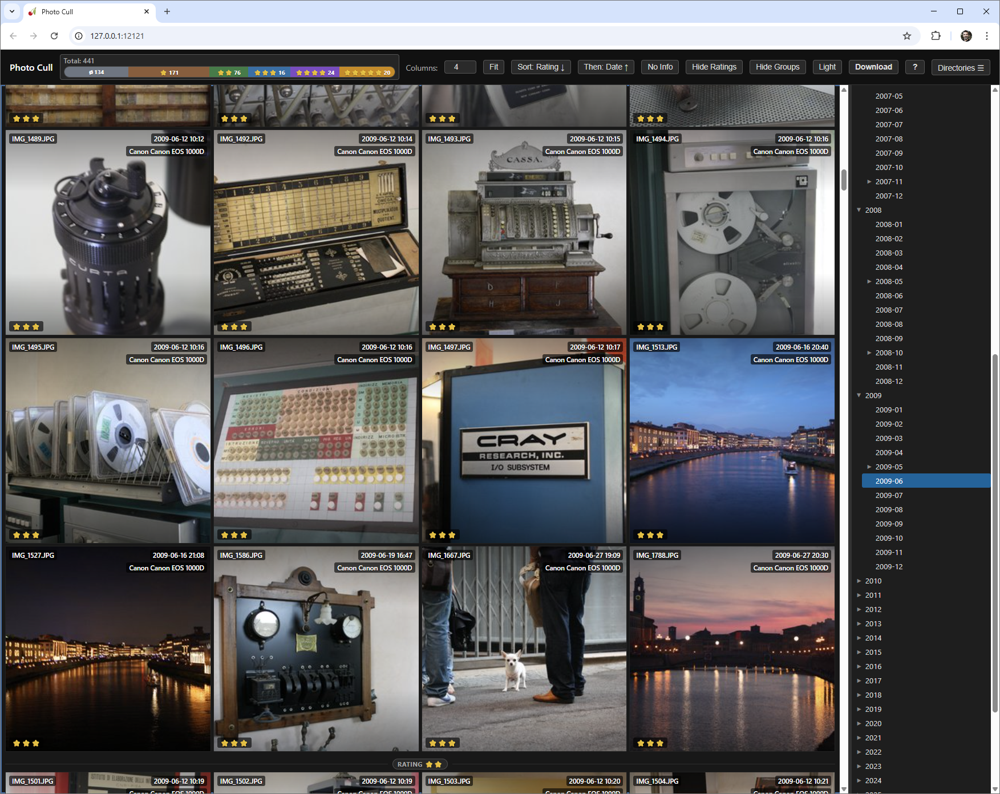
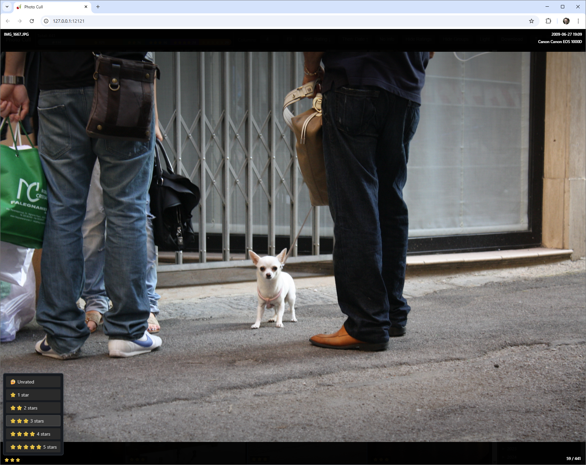
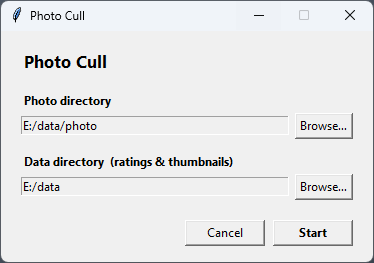
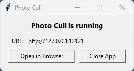

# Photo Cull

Photo Cull is a web app/windows app for quickly browsing folders of photos, assigning ratings, and downloading selected files.

It is designed for fast culling workflows: run locally, work on a browser, and rate images directly from your own filesystem.

<a href="screen_1.png"></a> &nbsp;&nbsp; <a href="screen_2.png"></a>

## Functionality and Use

Photo Cull provides these core features:

- Directory tree browsing for photo folders.
- Image grid with configurable columns.
- Full-page viewer for focused inspection.
- Star ratings (1 to 5) plus rating removal.
- Metadata display (date/time and EXIF summary when available).
- Sorting and grouping tools for faster review.
- Multi-selection and keyboard-first navigation.
- Download selected files (single file or ZIP archive).

### Typical workflow

1. Start Photo Cull and choose the folder containing your photos.
2. Browse folders in the sidebar.
3. Select photos and assign ratings.
4. Re-sort or group by name/date to review batches.
5. Download selected keepers if needed.


### Keyboard shorcuts

In addition to using a mouse/touch on the interface, almost any function in the application can be controlled through keyboard shortcuts, allowing for a faster and more efficient workflow without leaving the keyboard.

Shortcuts are listed in the help box, which is shown pressing the `?` key or clicking the "?" button in the top bar.

### Data storage

Photo Cull stores app data outside your original photo files:

- `.ratings.db`: SQLite database of ratings.
- `.cache/`: generated JPEG thumbnails.

By default, storage location depends on how you launch the app:

- `photo_cull.py`: current working directory unless `--data-dir` is set.
- `photo_cull_windows.py`: executable directory unless changed in startup dialog or with `--data-dir`.

## Running Photo Cull

Photo Cull can be run from source or you can download a **self-contained, portable executable for Windows** from the [releases](releases).

To run from source, follow this steps:

* Clone this repository or download the zip archive.

* Install dependencies

  ```bash
  pip install -r requirements.txt
  ```

* Run from Python script (direct server mode)

    ```bash
    python photo_cull.py <photo_directory>
    ```

    Example:

    ```bash
    python photo_cull.py "D:/Pictures"
    ```

    Available options:

    - `--data-dir <path>`: where `.ratings.db` and `.cache` are stored (default: current working directory).
    - `--host <host>`: server host (default: `127.0.0.1`).
    - `--port <port>`: server port (default: `12121`).

    Example with options:

    ```bash
    python photo_cull.py "D:/Pictures" --data-dir "D:/PhotoCullData" --host 127.0.0.1 --port 12121
    ```

    Then open:

    - `http://127.0.0.1:12121`

* Run Windows launcher

    ```bash
    python photo_cull_windows.py
    ```

    What it does:

    - Opens a startup dialog to choose photo directory and data directory. 
    
    

    - Starts a local CherryPy server.

    

    - Opens your default browser automatically.
    - Remembers last selected directories in `%USERPROFILE%/.photocull/state.json`.

    Optional arguments:

    - positional `directory`: initial photo directory.
    - `--data-dir <path>`: data directory override.
    - `--host <host>`: bind host (default: `127.0.0.1`).
    - `--port <port>`: preferred port (default: `12121`, auto-falls back if busy).

    Example:

    ```bash
    python photo_cull_windows.py "D:/Pictures" --data-dir "D:/PhotoCullData" --port 13000
    ```

## Build Windows executable

Use the included batch file:

```bat
build_windows_exe.bat
```

The script will build a one-file GUI executable with static assets, saving it to `dist/PhotoCull.exe`

## License

© 2026 Andrea Esuli

[BSD 3-Clause License](LICENSE).
